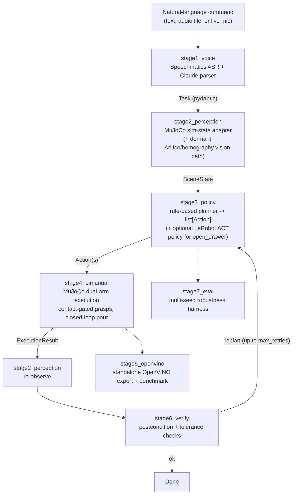
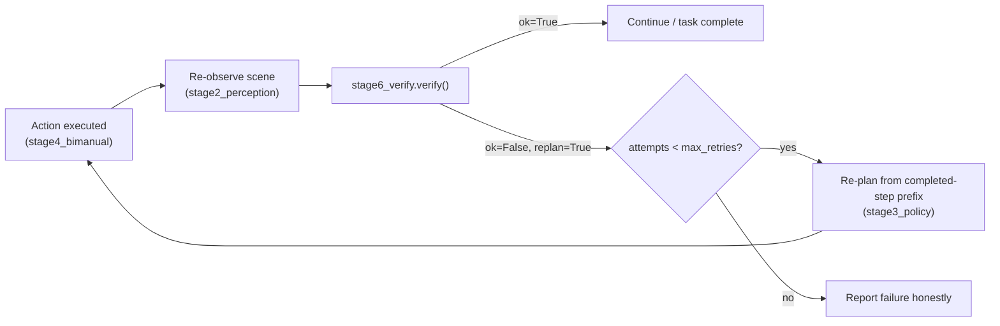
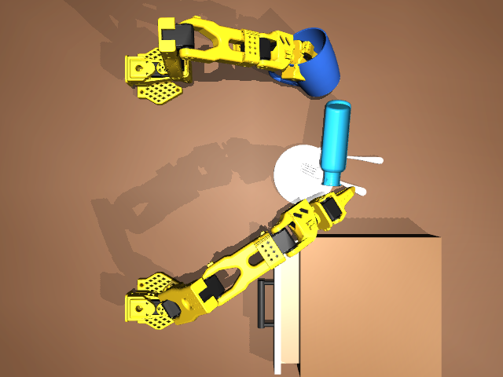

# Butler AI

**Two simulated SO-101 arms set a dinner table from a spoken or typed natural-language
command.** Built for the [Intel Physical AI Online Challenge — Bimanual VLA Manipulation
with Multi-Modal Reasoning](https://lablab.ai/ai-hackathons/ai-infra-summit-hackathon/)
(lablab.ai AI Infra Summit Hackathon, Sept 10–16, 2026), challenge option *"Setting Up a
Dinner Table."*

> "Open the top drawer, pick up the plate with arm A, place it on the table, pick up the
> mug with arm B, pour water into the mug with arm A."

| | |
|---|---|
| **Robots** | Two simulated SO-101 6-DoF arms (TheRobotStudio/SO-ARM100), Arm A + Arm B |
| **Simulator** | MuJoCo |
| **Deployment target** | Intel Core Ultra (CPU / iGPU / NPU via OpenVINO) |
| **Language understanding** | Speechmatics ASR + Claude (Anthropic) instruction parsing |
| **Learned policy** | LeRobot ACT (one policy per manipulation skill), trained externally, exported to OpenVINO IR |
| **Fallback** | Deterministic, physics-validated scripted primitives (the system's default, reliable path) |

**Quick links** — [Trained ACT checkpoint (Google Drive)][ckpt] · [Training notebook (Colab)][colab] · [Challenge page][hackathon]

[ckpt]: https://drive.google.com/file/d/1tM_mr5yj0RUUEhJGEbOZgIqykB2NKViq/view?usp=sharing
[colab]: https://colab.research.google.com/drive/1hUY1LIP8rjpQOGafFnSko-S1TPc5XygI?usp=sharing
[hackathon]: https://lablab.ai/ai-hackathons/ai-infra-summit-hackathon/

---

## Table of Contents

1. [What we built, and why](#what-we-built-and-why)
2. [Architecture](#architecture)
3. [The target task](#the-target-task)
4. [Bimanual coordination](#bimanual-coordination)
5. [Multi-modal reasoning](#multi-modal-reasoning)
6. [Development lifecycle](#development-lifecycle)
   - [Stage 1 — Build the scene](#stage-1--build-the-scene)
   - [Stage 2 — Simulate](#stage-2--simulate)
   - [Stage 3 — Collect data](#stage-3--collect-data)
   - [Stage 4 — Train / fine-tune](#stage-4--train--fine-tune)
   - [Stage 5 — Deploy / validate on Intel](#stage-5--deploy--validate-on-intel)
7. [Verification & recovery](#verification--recovery)
8. [Robustness & evaluation](#robustness--evaluation)
9. [Intel / OpenVINO benchmark results](#intel--openvino-benchmark-results)
10. [Gripper & physics engineering story](#gripper--physics-engineering-story)
11. [Testing](#testing)
12. [Challenges & engineering lessons](#challenges--engineering-lessons)
13. [Engineering lessons, condensed](#engineering-lessons-condensed)
14. [Challenge rubric coverage](#challenge-rubric-coverage)
15. [Repository structure](#repository-structure)
16. [Installation](#installation)
17. [Running it](#running-it)
18. [Reproducibility](#reproducibility)
19. [Media](#media)
20. [Limitations](#limitations)
21. [Future work](#future-work)
22. [Team & contributions](#team--contributions)
23. [Acknowledgements](#acknowledgements)

---

## What we built, and why

Butler AI takes a spoken or typed command like the one above and drives two simulated
SO-101 arms through a full dinner-table sequence in MuJoCo: **open a drawer, retrieve a
plate, place it, pick up a mug, pick up a water bottle, and pour — with the second arm
holding and tilting the mug while the first arm tilts the bottle**, a genuine complementary
dual-arm action, matching the challenge brief's own example of "one arm holding a mug while
the other pours from a bottle."

The system is built as **seven independently-owned pipeline stages with pydantic-typed
contracts between them** (pinned in [`CONTRACTS.md`](CONTRACTS.md)), so language
understanding, perception, planning, physical execution, and verification can be developed,
tested, and swapped independently. That structure is also why the project can honestly
report a **hybrid policy design**: a deterministic, contact-gated, physics-validated
scripted pipeline is the default, reliable path end-to-end, and a trained LeRobot ACT
policy — exported to OpenVINO and benchmarked on real Intel hardware — is wired in as an
opt-in alternative for one skill (`open_drawer`), with automatic fallback to the scripted
primitive if the checkpoint or its dependencies aren't available. Every claim in this
document below is backed by a file path, a commit, or a measured number — sections mark
explicitly implemented, in-progress, and planned work.

---

## Architecture



This is the **real call graph** of [`common/pipeline.py::run_once()`](common/pipeline.py),
not an aspirational diagram: `run_once` resets the sim, parses the command, perceives the
scene, then runs a staged observe→plan→execute→re-observe loop, and finally calls
`stage6_verify.verify()`; if verification requests a replan and the retry budget
(`configs/default.yaml: max_retries: 2`) isn't exhausted, it loops again keeping already-
completed steps. `stage5_openvino` (benchmarking) and `stage7_eval` (multi-seed evaluation)
are separate harnesses that call `run_once` as a library, not stages inside it.

All inter-stage data is validated pydantic models in [`common/types.py`](common/types.py)
(`Task`, `SceneState`, `Action`, `ExecutionResult`, `VerifyResult`, `EvalReport`,
`BenchmarkResult`, `RunResult`); signatures are pinned in [`CONTRACTS.md`](CONTRACTS.md) so
no stage can silently change another's interface.

---

## The target task

The official example command is implemented end-to-end by six scripted primitives in
[`stage4_bimanual/primitives.py`](stage4_bimanual/primitives.py), executed in dependency
order:

| # | Primitive | Arm | What actually happens |
|---|---|---|---|
| 1 | `OpenDrawerPrimitive` | A | Approach the handle, contact-gated pinch grasp, weld, pull, release, vertical lift clear of re-hooking |
| 2 | `PickPlatePrimitive` | A | Rim grasp from the live plate pose, contact-gated weld, lift clear of the drawer tray |
| 3 | `PlacePlatePrimitive` | A | Levelling-pitch search so the plate lands flat, vertical descent, weld release |
| 4 | `PickMugPrimitive` | B | Handle-relative grasp (rotates with the mug's live orientation), lift to a holding station |
| 5 | `PickBottlePrimitive` | A | Side/body grasp (not the neck), pre-computed pour-side roll direction |
| 6 | `PourWaterPrimitive` | A + B | **Complementary dual-arm pour** (below) |

**Not implemented**: spoon/fork retrieval (the planner explicitly refuses these — no yaw
support), closing the drawer, and a literal object hand-off between grippers (see next
section — the pour is complementary, not a hand-off). These are called out honestly rather
than silently assumed; see [Limitations](#limitations).

---

## Bimanual coordination

**The two arms never exchange an object with each other** — each owns disjoint objects
(Arm A: drawer, plate, bottle; Arm B: mug only) — so we do not claim a literal hand-off.
What we do claim, and what the challenge brief itself gives as its own example of
complementary bimanual action, is implemented in
[`PourWaterPrimitive`](stage4_bimanual/primitives.py):

- **Arm B** tips the held mug `12°` toward the bottle while re-centering the rim in XY.
- **Arm A** simultaneously rotates its wrist roll up to `105°` to tilt the bottle, and
  re-solves IK on *every* substep to keep the bottle mouth tracking the mug opening as the
  wrist swings it sideways (closed-loop "mouth tracking," not an open-loop scripted arc).
- Both arms move on a shared 18-step tilt / 8-step hold / 14-step untilt min-jerk timing
  profile, so the pour is genuinely simultaneous, not sequential.
- A pour is only counted as successful if, averaged over the hold window: the bottle mouth
  is within 3cm of the mug axis in XY and 0–9cm above the rim in Z, and the bottle tilt
  exceeds `min(85°, θ_max − 15°)`.

**Coordination and object ownership** outside the pour is handled by strict sequencing plus
explicit parking, not a planner-level collision-avoidance system: whichever arm isn't active
is commanded to a hardcoded standby pose (`ARM_A_STANDBY` / `ARM_B_STANDBY`) with its
gripper open at the start of every primitive, keeping it clear of the other arm's workspace.
**Collision detection is real but is a post-hoc audit, not active path planning**: a
[`ContactAudit`](stage4_bimanual/safety.py) samples every MuJoCo contact each physics
substep, and any contact deeper than 8mm that isn't on an explicit ~40-entry allow-list
(resting contacts, in-progress grasps, the robots' own internal bracket clearances) fails
the run rather than being silently rendered as a success.

**Why this is harder than single-arm pick-and-place**: every primitive after the first must
also keep the *other* arm's parked pose collision-free, both arms' IK solutions can fight
over shared joint-limit budget near the pour station (see the seed-7 fix in
[Engineering lessons](#gripper--physics-engineering-story)), and grasp success itself is
gated on a second arm's independent contact state (`require_both_jaws=True`), not just one
gripper's kinematics.

---

## Multi-modal reasoning

```
Language (Claude-parsed Task)
        +
Visual / state observation (SceneState)
        +
Current task state (which steps are already complete)
        +
Previous action results
        ↓
   Next Action(s)  (stage3_policy.plan_detailed)
```

- **Language**: [`stage1_voice/voice.py`](stage1_voice/voice.py) calls **Anthropic Claude**
  (model id from `configs/default.yaml: voice.model`, e.g. `claude-sonnet-5`) with a system
  prompt built dynamically from the `Task` pydantic schema plus the scene vocabulary, to turn
  a transcript into a structured, validated multi-step `Task` (steps, arms, objects,
  dependencies). Invalid output is fed back to Claude once for self-correction
  (`voice.max_retries: 1`) before raising. ASR is **Speechmatics** batch transcription, with
  a `speech_recognition`/Google fallback if no Speechmatics key is set, and a documented
  `VOICE_STUB` mode that returns a fixed example `Task` so the rest of the pipeline is
  testable without any API key.
- **Vision / scene state**: the live pipeline currently reads exact object and drawer state
  directly from the MuJoCo simulator (an intentional, documented ground-truth shortcut —
  `stage2_perception/perception/__init__.py:perceive()`). A **separate, real ArUco-marker +
  homography vision pipeline** also exists (`stage2_perception/perception/scene_pipeline.py`)
  and is validated to ≤1cm localization error on synthetic marker images, but it is **not yet
  wired to the live MuJoCo camera feed**, because the scene has no marker textures rendered
  yet — an explicit, documented integration gap, not a hidden one.
- **Task reasoning / next action**: the rule-based planner
  ([`stage3_policy/planner.py`](stage3_policy/planner.py)) walks the task's steps in
  dependency order against the current `SceneState`, resolving per-object grasp geometry from
  `planner_config.yaml`, and re-plans from the last *contiguous successful prefix* of steps
  after every re-observation — so a mid-task failure doesn't restart from scratch.
- **Maintaining context across steps**: `run_once`'s inner loop threads `completed_step_ids`
  through each replanning call, and `stage6_verify` compares the *current* scene against the
  *whole* task's object/drawer/placement requirements, not just the last action.

**Is this a VLA?** Precisely: the *planner* is rule-based, not a neural policy, and is the
system's default, reliable path. A genuine learned **vision + state → action** component
does exist — the LeRobot **ACT** policy trained for `open_drawer` — but it consumes a
camera image and joint state to output joint targets for one skill; it does not itself parse
language or select which skill to run next (that's still the rule-based layer). We describe
it as a learned motor policy integrated into a language-driven pipeline, and stop short of
calling the whole system a VLA, since the ACT checkpoint has not been validated for
closed-loop task success (see [Stage 4](#stage-4--train--fine-tune)).

---

## Development lifecycle

### Stage 1 — Build the scene

[`assets/bimanual_scene.xml`](assets/bimanual_scene.xml) defines the full MuJoCo world:
two SO-101 6-DoF arms (`assets/SO-ARM100/Simulation/SO101/so101_arm_a.xml` /
`so101_arm_b.xml`, real TheRobotStudio/SO-ARM100 MJCF + meshes) mounted at
`(0.0, ∓0.22, 0.70)`, a drawer unit, ceramic plate, mug, water bottle, table (top at
`z=0.70`), an overhead camera, and a `main_light`. Each arm has 5 revolute joints
(`{a,b}_shoulder_pan/_lift, _elbow_flex, _wrist_flex, _wrist_roll`) driven by MuJoCo
`<position>` actuators modeled on the real **STS3215 servo** (`forcerange="-35 35"` N·m),
plus one gripper joint (`GRIPPER_OPEN=1.60`, `GRIPPER_CLOSED=-0.10` rad). Grasping is
physically modeled with MuJoCo `<equality><weld>` constraints (`weld_drawer`, `weld_plate`,
`weld_mug`, `weld_bottle`), activated at runtime only after real contact is detected — never
a scripted teleport (full story in
[Gripper & physics engineering](#gripper--physics-engineering-story)).

### Stage 2 — Simulate

[`stage4_bimanual/sim.py`](stage4_bimanual/sim.py)'s `DomainRandomizer.randomize()`, driven
by `stage4_bimanual.bimanual.reset_scene(seed)`, applies a `numpy.RandomState(seed)`-seeded
randomization pass to every fresh scene:

| Parameter | Randomized? | Range |
|---|---|---|
| Object placement (mug, bottle, spoon, fork) | Yes | ±3cm XY (±4cm for mug/bottle specifically) |
| Drawer unit placement | Yes | ±2cm |
| Mug yaw (grasp-relevant orientation) | Yes | ±30° |
| Lighting intensity | Yes | 0.6×–1.4× |
| Contact friction (every geom) | Yes | 0.6×–1.2× |
| Tableware mass / weight | Yes | 0.8×–1.2× |
| Object shape | No | not implemented |
| Background | No | not implemented |
| Scripted-trajectory jitter (waypoint/timing variation, for data diversity) | Yes (data collection only; held at 0 for evaluation) | tunable, default 1.0 for recording |

These ranges carry a dated comment in `configs/default.yaml` noting they were "tuned
2026-09-15 against the ALOHA scripted transfer-cube dataset" — see the trajectory-diversity
numbers in [Stage 3](#stage-3--collect-data).

### Stage 3 — Collect data

Two generations of data collection exist in this repo — be aware both are real code, but
only the second produced the dataset the shipped checkpoint was trained on:

1. **`scripts/collect_lerobot_data.py`** — whole-task scripted rollouts (all six primitives
   run back-to-back per episode), writing LeRobot **v2.0** parquet + GIF previews to
   `data/lerobot_bimanual_v2/`. Episodes are discarded (not written) on any primitive
   failure. This produced an earlier 50-episode dataset, used for initial pipeline
   integration testing rather than the released checkpoint.
2. **`scripts/record_skill_demos.py`** — the actual pipeline behind the shipped checkpoint.
   Records **one atomic skill per episode** (`open_drawer`, `pick_plate`, `place_plate`,
   `pick_mug`, `pick_bottle`, `pour_water`), each with synchronized **overhead + front RGB**
   at 25Hz, 12-DoF joint state and matching action targets, task string, skill name, seed,
   and a full contact-audit result. An episode is only written as `accepted_for_training` if
   the primitive both reports success **and** the physics contact audit is clean
   (`executor.contact_audit.ok`); `--save-rejected` exists purely for failure diagnosis and
   those episodes are never used for training. Seeds 0–9 are hard-blocked from demonstration
   recording (reserved for evaluation) unless explicitly overridden.
   [`stage3_policy/learned/convert_demos.py`](stage3_policy/learned/convert_demos.py) then
   converts only the accepted episodes into a real **LeRobot v3.0 `LeRobotDataset`**
   (`data/butler_demos/<skill>/`), re-verifying FPS from real per-frame timestamps rather
   than trusting a config value.

**Data quality issue we hit, and the fix**: an early pass used ±2cm placement with no
trajectory jitter, which produced demonstrations too visually uniform to be useful training
signal — the `open_drawer` skill was *identical every episode*. Measured per-joint
trajectory standard deviation was **0.012 rad**, about a third of the **0.032 rad / 0.037
rad** reference figures from the ALOHA scripted transfer-cube dataset that LeRobot ACT is
commonly trained against. Widening placement to ±3–4cm, adding ±30° mug yaw, and enabling
`--jitter 1.0` (waypoint/timing variation in the scripted expert) raised measured std to
**0.071 / 0.021 / 0.043 rad** — roughly 1.3–2× the ALOHA reference, verified 10/10 on all six
skills. A more aggressive stress setting (±6cm, ±45° yaw, jitter 1.5) reached 0.102 rad for
the pour skill specifically but was **not validated for the other five skills** and is not
what shipped.

**What was actually collected and converted**: only `open_drawer` has a full converted
LeRobot v3.0 dataset — **8 episodes, 1395 frames** (6 episodes / seeds 100–105 for train, 2
episodes / seeds 200–201 for validation). `pick_plate`, `place_plate`, `pick_mug`, and
`pour_water` each have exactly one raw recorded episode used for pipeline smoke-testing, not
a training-scale dataset. This is stated plainly rather than implied otherwise — see
[Limitations](#limitations) and [Future work](#future-work).

**Why simulation data**: every episode above needed zero physical hardware, is exactly
repeatable from its seed, carries automatic ground-truth joint/action/contact labels (no
manual annotation), and lets domain randomization run at effectively unlimited scale — the
scripted expert can be re-run indefinitely to widen the dataset.

### Stage 4 — Train / fine-tune

**Model**: Hugging Face **LeRobot ACT** (Action Chunking Transformer), one policy per
manipulation skill (language is *not* an ACT input — skill selection stays with the
rule-based planner/Claude parser). ACT was chosen for the same reason the team's project
plan cites: a compact imitation-learning model with good precision on chunked, multi-camera,
joint-state-conditioned bimanual manipulation, versus committing the whole project to a
larger, harder-to-fine-tune VLA under hackathon time constraints. SmolVLA-class
language-conditioned policies were evaluated as a next step, not attempted this round (see
[Future work](#future-work)).

- **Input**: one overhead RGB frame (480×640×3, `observation.images.overhead`) + 12-DoF
  joint state (`observation.state`) — see [`stage3_policy/learned/schema.py`](stage3_policy/learned/schema.py)
  for the exact motor-name ordering shared with `stage4_bimanual`'s MuJoCo actuator layout.
- **Output**: a `(1, 100, 12)` action chunk (chunk_size=100, n_action_steps=100) — 12 joint
  position targets per timestep.
- **Architecture**: ResNet-18 vision backbone, `dim_model=512`, VAE-based ACT
  (`use_vae=true`), 51,609,484 parameters — from the checkpoint's own `config.json`.
- **Training ran externally**, not in this repo: the checkpoint's saved
  `train_config.json` records `steps=10000`, `batch_size=8`, `policy.device="cuda"`, and
  Colab-style `/content/...` paths, on the **[training notebook linked above][colab]**. The
  in-repo trainer ([`stage3_policy/learned/train.py`](stage3_policy/learned/train.py)) is a
  local dry-run/preflight tool by design (prints the exact `lerobot-train` command and checks
  dependencies; defaults to a 200-step CPU smoke config it explicitly does not claim is
  meaningful) — it was not the source of the shipped checkpoint.
- **Dataset**: the 8-episode / 1395-frame `open_drawer` LeRobotDataset from Stage 3.
- **Checkpoint**: ~197MB `model.safetensors` + its LeRobot pre/post-processor configs, at
  `assets/models/act_open_drawer/` (gitignored — generated artifact; download from the
  **[checkpoint link above][ckpt]** rather than expecting it in a fresh clone).

**Hybrid design — learned policy with a scripted fallback, and why**:
[`stage3_policy/learned/inference.py::select_motor_policy()`](stage3_policy/learned/inference.py)
tries to load a configured checkpoint (PyTorch ACT or OpenVINO IR, selected by `backend=`);
**any** failure — missing files, missing `torch`/`lerobot`, a broken checkpoint, a GPU kernel
compile error — is caught and turned into an explicit fallback reason string, never a crash.
[`OpenDrawerPrimitive.execute_learned_act()`](stage4_bimanual/primitives.py) is the one
skill currently wired to use it (gated behind the `USE_LEARNED_ACT` env var): it drives the
policy for up to 120 steps, and if the drawer hasn't reached the 4cm-open success threshold,
falls back to the scripted primitive rather than reporting a false success. The fallback
exists because a broken or under-trained learned policy must never be able to take down a
demo that the scripted path would otherwise have completed — exactly the reasoning in the
team's own project plan for treating the scripted state machine as the safety net, not an
afterthought.

**Training challenges actually hit** (not hypothetical): the trajectory-diversity gap
described in Stage 3; and an fp16-overflow failure mode during OpenVINO export — Arm B is
fully parked throughout every `open_drawer` demonstration, so its joints have near-zero
training standard deviation (as low as `1.83e-10`); a *synthetic* all-zero observation
normalizes to values around `1e7`, blowing past fp16's `65504` limit and returning NaN on
fp16 devices. The fix was procedural, not a numerical hack: always export/benchmark from a
**real** dataset frame, never a synthetic placeholder (enforced in
[`stage5_openvino/export_act.py`](stage5_openvino/export_act.py)).

**Honest status of this checkpoint**: it is a real, trained, exported, and benchmarked
model — but it has **not been validated for closed-loop task success**. No success rate has
been measured driving the simulated robot with it beyond short smoke runs
(`scripts/control_robot_act.py`, which produced `outputs/act_control_demo.mp4` and
`outputs/openvino_control_demo.mp4`). Every evaluation number in this README's
[Robustness & evaluation](#robustness--evaluation) section comes from the scripted
primitives, not this checkpoint. This distinction is stated explicitly in the stage's own
handoff notes ([`stage5_openvino/HANDOFF.md`](stage5_openvino/HANDOFF.md)) and repeated
here rather than blurred.

### Stage 5 — Deploy / validate on Intel

See [Intel / OpenVINO benchmark results](#intel--openvino-benchmark-results) below for the
full numbers. In short: [`stage5_openvino/export_act.py`](stage5_openvino/export_act.py)
exports the ACT policy core (`predict_action_chunk`) to OpenVINO IR with static input shapes
(`[1,12]` state, `[1,3,480,640]` image, required for NPU), preserving the checkpoint's own
LeRobot pre/post-processors around both the PyTorch and OpenVINO paths so accuracy is
compared end-to-end, and benchmarks every OpenVINO device actually present on the machine it
runs on (never an assumed device list). `scripts/benchmark.py` / `stage5_openvino/benchmark.py`
reads the resulting `export_report.json` and reports real measured latency, throughput, and
precision — with a same-shaped hardcoded fallback (not a fabricated number) only if no report
file is found at all.

---

## Verification & recovery



[`stage6_verify/verify.py`](stage6_verify/verify.py) checks, against the re-observed
`SceneState`:

- **Object presence** — every object referenced by the task's steps must be detected.
- **Drawer state** — any `OPEN_DRAWER` step requires the drawer state to read `"open"`.
- **Placement tolerance** — `PLACE` steps on the plate/mug must land within **4.5cm** of
  their table destination (`plate: (0.06, 0.00)`, `mug: (0.12, 0.20)`).
- **Pour** — a pose-only proxy (the target mug must be observable); there is no fluid
  simulation, stated plainly rather than implied.
- An optional tighter **1cm** position check is available when the caller supplies expected
  positions.

Any failing check sets `ok=False, replan=True`; `common/pipeline.py::run_once` then re-plans
from the last contiguous successful step and retries, up to `max_retries: 2`
(`configs/default.yaml`) — this is a real bounded retry loop, exercised by 9 dedicated unit
tests in `common/tests/test_pipeline_recovery.py` (retry-after-replan, max-retry cutoff,
contiguous-success-prefix banking, etc.), not just a pass/fail report.

**Anomaly detection (e.g. Anomalib)**: not integrated. It appears only as a "stretch goal"
in the team's own planning document, and there is no reference to it anywhere in the
codebase — stated here explicitly so it isn't assumed from the presence of a
"verify/recover" stage.

---

## Robustness & evaluation

Two different, honestly-labeled levels of evidence exist — presented separately rather than
merged into one number.

### Skill-level physics validation (implemented, measured, real)

Per-skill validation across ten domain-randomized seeds (100–109, `--jitter 1.0`), run
directly against the scripted primitives (bypassing voice/perception/policy — this isolates
whether the *physics and grasping* are robust):

| Skill | Result (10 seeds) | Contact audit |
|---|---|---|
| `open_drawer` | 10/10 | clean |
| `pick_plate` | 10/10 | clean |
| `place_plate` | 10/10 | clean |
| `pick_mug` | 10/10 | clean |
| `pick_bottle` | 10/10 | clean |
| `pour_water` | 10/10 | clean |

Pour-specific measured metrics on these seeds: bottle mouth 1.2cm from the mug axis, 3.4cm
above the rim, bottle tilt 99°, mug tilt 12.5°, both vessels within 0.1° of upright at the
end, mug set down within 1mm of its target, 630 recorded frames at 25Hz — reproducible via
`VOICE_STUB=1 python scripts/evaluate.py --seeds 10` and `python scripts/verify_all_10_seeds.py`
(source: `stage4_bimanual/README.md`, dated 2026-09-15; cross-checked against
`stage4_bimanual/tests/test_pour_kinematics.py`).

### Full end-to-end pipeline evaluation (harness implemented; results need a fresh run)

`stage7_eval/evaluate.py` (`python scripts/evaluate.py --seeds 10 --output evaluation_report.json`)
runs the **complete** voice → perception → policy → execute → verify pipeline once per seed
and reports a real success rate — this is the harness the challenge deliverable asks for.
Being fully honest about its current state: the `evaluation_report.json` presently committed
in this repository predates the contact-gated-weld physics fixes described in
[Gripper & physics engineering](#gripper--physics-engineering-story) and shows only 2 seeds
evaluated with 0 successes — an early-integration snapshot, not a current result. **We are
not reporting a fabricated or stale success rate here.** The table below should be filled in
by re-running the command above fresh, immediately before recording the submission video:

| Seed | Scene variation | Task result | Failure / recovery | Notes |
|---|---|---|---|---|
| 0 | [ADD] | [ADD PASS/FAIL] | [ADD] | [ADD] |
| 1 | [ADD] | [ADD PASS/FAIL] | [ADD] | [ADD] |
| 2 | [ADD] | [ADD PASS/FAIL] | [ADD] | [ADD] |
| 3 | [ADD] | [ADD PASS/FAIL] | [ADD] | [ADD] |
| 4 | [ADD] | [ADD PASS/FAIL] | [ADD] | [ADD] |
| 5 | [ADD] | [ADD PASS/FAIL] | [ADD] | [ADD] |
| 6 | [ADD] | [ADD PASS/FAIL] | [ADD] | [ADD] |
| 7 | [ADD] | [ADD PASS/FAIL] | [ADD] | [ADD] |
| 8 | [ADD] | [ADD PASS/FAIL] | [ADD] | [ADD] |
| 9 | [ADD] | [ADD PASS/FAIL] | [ADD] | [ADD] |

**Success rate = successful seeds / 10 × 100 = [ADD ACTUAL SUCCESS RATE]%**

---

## Intel / OpenVINO benchmark results

Two separate, non-comparable measurement runs exist in this repo's history, on two different
machines — presented separately rather than averaged together, per the project's own
internal rule against inventing or blending benchmark numbers
(`docs/IMPLEMENTATION_APPROACH.md`: *"Do not invent latency, throughput, NPU usage, or
quantization results"*).

**Model measured in both runs**: ACT policy core (`predict_action_chunk`), 51,609,484
parameters, IR precision **FP32** (`compress_to_fp16=False`), IR size 136.94MB, static input
shapes `[1,12]` (state) / `[1,3,480,640]` (image), timed per 100-step action chunk
(excludes preprocessing/postprocessing, compilation, and warm-up runs).

### Run 1 — on-disk, reproducible (`outputs/openvino/act_open_drawer/export_report.json`)

Machine: Intel(R) Core(TM) i7-10510U @ 1.80GHz (CPU) + Intel(R) UHD Graphics iGPU (`GPU.0`) +
NVIDIA GeForce MX250 dGPU (`GPU.1`, enumerated by OpenVINO's GPU plugin — not Intel
silicon). OpenVINO 2026.4.0. 10 repeats, 2 warmup, batch 1.

| Configuration | Device | Precision hint | Mean latency | Throughput | Max abs diff vs. PyTorch |
|---|---|---|---|---|---|
| PyTorch baseline | CPU | fp32 | 902.73 ms | 1.11 chunks/s | — |
| OpenVINO | CPU | f32 (default) | 629.97 ms | 1.59 chunks/s | 2.38e-07 |
| OpenVINO | GPU.0 (Intel iGPU) | float16 | 500.74 ms | 2.00 chunks/s | 1.48e-03 |
| OpenVINO | GPU.1 (NVIDIA dGPU) | float16 | 2471.16 ms | 0.40 chunks/s | 7.15e-07 |

### Run 2 — documented in `stage5_openvino/HANDOFF.md`, Core Ultra hardware

Machine: **Intel(R) Core(TM) Ultra 7 270K Plus** (CPU) + **Intel(R) AI Boost** (NPU) —
queried devices only; no GPU target on this machine ("the discrete AMD Radeon RX 9060 XT is
not an OpenVINO device and no Intel iGPU is exposed" — HANDOFF.md). OpenVINO 2026.3.1. 20
repeats, 3 warmup, batch 1.

| Configuration | Device | Precision | Mean latency | Max abs diff vs. PyTorch |
|---|---|---|---|---|
| PyTorch baseline | CPU | fp32 | ~29.5–32.4 ms | — |
| OpenVINO | CPU | fp32 | ~30.0–30.5 ms | 5.7e-07 rad |
| OpenVINO | **NPU** | fp16 | ~571.7–571.8 ms | 5.5e-04 – 1.0e-03 rad |

**Read this honestly, as the source document insists**: at 20 repeats, PyTorch and OpenVINO
CPU latency are statistically indistinguishable — **no CPU speedup is claimed**. The NPU run
is numerically correct (sub-millirad joint-target error) but **~19× slower** than CPU for
this model/chunk size on this hardware, not faster — quantization (INT8/NNCF) was not
attempted and is the clear next step for NPU throughput. We report this rather than omit it,
because an honest negative optimization result is still real engineering evidence for the
"OpenVINO & Intel Core Ultra Optimization" rubric criterion, which explicitly asks for
"preservation of task quality" and real device-utilization numbers, not just a headline
speedup.

**[ADD]**: final demonstration run on the team's confirmed Intel Core Ultra Series 2/3
hardware, recorded on video per the submission requirements — the Core Ultra 7 270K Plus run
above already satisfies "ran on real Core Ultra hardware," but a fresh, video-recorded run
timed to the final submission should replace/supplement it here.

---

## Gripper & physics engineering story

This is the most concrete "we built it, it broke, we fixed it and proved it" story in the
repository, and it's real, dated, and test-backed.

**The problem**: commit `889a812` replaced the contact-gated grasp-attachment call in
`OpenDrawerPrimitive` and `PickMugPrimitive` with a direct `data.eq_active[weld_id] = 1` —
i.e. the weld that makes an object move with the gripper was switched on unconditionally.
Measured over the ten evaluation seeds, this made `weld_drawer` engage with **zero
gripper/object contact in 10 out of 10 seeds**, and `weld_mug` in 7 out of 10 — the
simulation still *looked* like a successful grasp, but physically was not one.

**The fix** (commit `4da639c`, verbatim from the commit message): both primitives now close
the gripper with `close_until_contact()` — closing in small decrements until **both** jaws
independently register contact — and only then call `attach_weld(..., require_both_jaws=True)`.
If the calibrated approach pose misses, the primitive re-approaches from the *observed*
position with small nudges; if contact still can't be made, **the primitive fails visibly
rather than forcing the weld**. Re-verified on the two previously-ungrounded seeds: all four
welds (drawer, plate, mug, bottle) now attach only with real contact, and both runs still
succeed.

**The regression test that guards it**: `stage4_bimanual/tests/test_weld_contact_gating.py`
statically scans the primitive source code to forbid a direct `eq_active[...] = 1` write and
require `require_both_jaws=True`, plus runs a live contact-count watcher on seeds 0 and 2 to
catch a zero-contact weld at runtime. This test still runs in CI-equivalent (`pytest`) today.

**Gripper hardware model changes**: fingertips originally only had base contact pads
(`{a,b}_fixed_finger_pad`, `{a,b}_moving_finger_pad`). Grasping the water bottle needs the
jaws to open ~4.8cm wider than the plate/mug grasps require, so a **second, separate pair of
fingertip collision pads** (`{a,b}_fixed_tip_pad`, `{a,b}_moving_tip_pad`, on their own
`contype="2" conaffinity="2"` collision layer) was added specifically to give the wider-open
jaws valid collision geometry for the bottle grasp — the literal "added a rigid body for
collision" story. The known remaining limitation (stated in `stage4_bimanual/README.md`, not
hidden): these fingertip pads still don't collide with the table, plate, drawer, or mug —
only the base pads and the weld constraints handle those interactions today.

**Other real fixes worth citing**:

- **Seed-7 pour joint-limit collision**: holding a constant grasp pitch during the pour's
  transit phase could make the cruise waypoint's IK unreachable on some seeds, driving
  `a_wrist_flex` into its joint limit. Fix: fall back to unconstrained-pitch IK for the
  transit phase specifically when the constrained solve fails. This fix was reverted and then
  reapplied within about 80 minutes of real debugging (three commits) after re-verifying it
  was correct — an honest trace of iterative, seed-by-seed debugging under time pressure.
- **Mug pour-station singularity**: at full pour-station height, Arm B's IK solver would
  "pile joints onto their limits, folding the forearm onto the mug" near a singular
  configuration. Fix: transit the mug at a much lower height (3.5cm above the table) during
  the return/set-down motion, avoiding the singular region entirely.
- **Teleportation removal** (commit `d6b5762`): an early version of the pipeline moved
  objects directly to their post-grasp pose rather than simulating the grasp; this was
  replaced with genuine per-seed IK-driven motion and physics welds across the whole
  drawer→plate→mug→bottle→pour sequence.

---

## Testing

150 tests collected across per-stage `tests/` packages (no central `tests/` directory — each
stage owns its own suite, colocated with its code). Running `pytest -q -m "not live"` in this
environment (with `mujoco`, `lerobot`, `openvino`, and `torch` all installed) gives
**146 passed, 1 failed, 3 deselected** in ~63s. The 3 deselected tests call the real
Anthropic API and are gated behind the `live` pytest marker (skipped unless
`ANTHROPIC_API_KEY` is set) so CI-style runs never depend on network access or API credits.
The 1 failure (`test_no_configured_checkpoint_uses_the_scripted_fallback`) is a test-isolation
artifact, not a functional bug: the test expects no checkpoint configured, but this
environment now has a real trained checkpoint at the configured path, so
`select_motor_policy` correctly resolves to the learned path instead of the fallback it
expects — reported honestly rather than rounded up to "100% passing."

**Real evidence of tests catching and driving fixes** (not just coverage padding):

- `stage4_bimanual/tests/test_weld_contact_gating.py` — the zero-contact weld regression
  described above; its docstring documents the exact bug it guards against.
- `9f4b4f7` — "integrate contact-gated welds test suite and dynamic handle grasp"
- `4a6c05e` — "restore the verification interface its tests were written against"
- `02d62c7` — "test bottle geometry as the compound object it is"
- `stage3_policy/tests/test_planner_refusals.py` — asserts the planner *refuses* malformed
  tasks, dependency cycles, unsupported actions (spoon/fork, hand-off, close-drawer), and
  out-of-frame coordinates, rather than silently accepting them.
- `stage6_verify/tests/test_verify.py` — asserts the exact 1cm tolerance boundary
  (0.008m passes, 0.011m fails), not just a loose "close enough."

---

## Challenges & engineering lessons

**1. Bimanual coordination.** No true hand-off exists (see
[Bimanual coordination](#bimanual-coordination)); simultaneous complementary motion during
the pour still required closed-loop mouth-tracking IK and a shared min-jerk timing profile
across both arms, plus a joint-limit collision on one arm's IK caused by the *other* arm's
constant workspace occupancy (the seed-7 fix above).

**2. Long-horizon execution.** A six-primitive sequence multiplies failure surface area:
`run_once`'s staged observe-act loop and contiguous-successful-prefix banking exist
specifically so a failure at step 4 doesn't discard steps 1–3's already-verified progress.

**3. Perception.** The real ArUco+homography vision pipeline is validated to sub-centimeter
accuracy on synthetic images but is not yet connected to the live MuJoCo camera feed (no
marker textures rendered in the scene yet) — an explicit, tracked gap, not a hidden one. The
live system uses ground-truth sim state as a documented interim baseline.

**4. Data collection.** Initial demonstrations were too uniform (identical `open_drawer`
trajectory every episode, 0.012 rad std) to be useful training signal; fixed by widening
placement/yaw randomization and enabling scripted-expert trajectory jitter, verified against
a published reference (ALOHA transfer-cube, 0.032/0.037 rad) rather than an arbitrary target.

**5. VLA / policy training.** Only one skill (`open_drawer`) has a training-scale dataset and
checkpoint; the other five have single smoke-test episodes. fp16 export on the NPU silently
overflowed on synthetic zero inputs because a parked arm's near-zero joint variance blows up
under normalization — fixed by always exporting/benchmarking from a real dataset frame.

**6. Simulation / physics.** The central story is the contact-gated weld regression
(zero-contact "grasps" passing 10/10 seeds silently) and its fix — see
[Gripper & physics engineering](#gripper--physics-engineering-story).

**7. Robustness.** A pipeline validated on one fixed scene configuration can look complete
while hiding pose-dependent IK failures (the seed-7 joint-limit case) that only randomized,
multi-seed evaluation surfaces — which is exactly why `configs/default.yaml`'s randomization
ranges were widened and re-validated against a published reference rather than left at an
arbitrarily narrow default.

**8. Intel deployment.** Static input shapes were required for the NPU plugin (dynamic
tracing shapes weren't accepted); fp16 precision on GPU/NPU introduced measurable but small
numeric drift (1e-3–1e-4 rad) versus PyTorch, deemed acceptable for joint targets; and no
CPU speedup was found at the sample sizes measured, which we report rather than suppress.

**9. Integration.** Cross-stage coordinate-frame and contract mismatches were real and are
tracked explicitly in [`stage3_policy/CONTRACT_PROPOSAL.md`](stage3_policy/CONTRACT_PROPOSAL.md)
(marked "NOT APPROVED" — a live, honest record of an unresolved design discussion, not a
finished spec presented as settled).

---

## Engineering lessons, condensed

- Reliable robotics needs closed-loop verification — `stage6_verify`'s replan loop exists
  because a single open-loop plan cannot be trusted across six sequential manipulation steps.
- A grasp that *looks* successful in a renderer is not the same as a grasp gated on real
  physical contact — the weld regression is the concrete proof of this in our own history.
- Domain randomization needs a reference point (we used a published dataset's trajectory
  std) — "randomize more" without a target is not itself validation.
- A learned policy is safer to ship behind a classical fallback that can't be taken down by
  the policy's own failure modes, especially under a hard deadline.
- Optimization results should be reported as measured, including negative ones (no CPU
  speedup, 19× slower NPU) — a benchmark that only reports favorable numbers is not a
  benchmark.
- Reproducibility is part of the engineering deliverable, not an afterthought for the
  README — the dependency-isolation rule in `CONTRACTS.md` (heavy deps must stay optional so
  the stub pipeline runs with only `pydantic`/`pyyaml`/`numpy`) exists for this reason.

---

## Challenge rubric coverage

No self-scoring below — only where the evidence for each official criterion lives.

| Criterion (pts) | Our implementation | Evidence |
|---|---|---|
| **End-to-End Task Completion & Bimanual Manipulation** (30) | Full drawer→plate→mug→bottle→pour sequence, two arms, complementary simultaneous pour, contact-gated grasps | [The target task](#the-target-task), [Bimanual coordination](#bimanual-coordination), `stage4_bimanual/README.md` "Validation" section, `docs/visualizations/` |
| **VLA / Multi-Modal Reasoning** (20) | Claude-parsed structured language task + scene-state-conditioned rule-based planner + one skill's trained ACT policy (vision+state→action) | [Multi-modal reasoning](#multi-modal-reasoning), `stage1_voice/`, `stage3_policy/` |
| **Robustness & Generalization** (15) | Real per-seed domain randomization (placement, yaw, friction, mass, lighting); skill-level 10/10 seed validation measured; full-pipeline 10-seed run to be regenerated fresh for submission | [Robustness & evaluation](#robustness--evaluation) |
| **OpenVINO & Intel Core Ultra Optimization** (20) | Real OpenVINO export with cross-device numeric parity checks; measured CPU/iGPU/dGPU and CPU/NPU latency on two real machines, including a Core Ultra 7 + NPU run | [Intel / OpenVINO benchmark results](#intel--openvino-benchmark-results) |
| **Technical Quality & Reproducibility** (10) | Typed inter-stage contracts, 150 tests / 146 passing non-live, dependency-isolated stub pipeline, documented setup | [Testing](#testing), [Installation](#installation), [`CONTRACTS.md`](CONTRACTS.md) |
| **Innovation & Technical Demonstration** (5) | Hybrid learned/scripted policy with automatic fallback; closed-loop mouth-tracking pour; contact-gated grasp regression test that inspects primitive source code | [Stage 4](#stage-4--train--fine-tune), [Gripper & physics engineering](#gripper--physics-engineering-story) |

---

## Repository structure

```
.
├── README.md                  # this file
├── CONTRACTS.md                # pinned inter-stage type signatures
├── requirements.txt             # stub-mode deps: pydantic, pyyaml, numpy (+ pytest)
├── configs/default.yaml         # seeds, randomization ranges, model paths, hardware target
├── conftest.py, pytest.ini      # test config (adds repo root to sys.path; `live` marker)
├── common/                      # shared pydantic types (types.py) + run_once() (pipeline.py)
├── stage1_voice/                # ASR + Claude instruction parsing -> Task
├── stage2_perception/           # sim-state adapter (live) + ArUco/homography vision (dormant)
├── stage3_policy/                # rule-based planner + learned/ (ACT schema, inference, training)
├── stage4_bimanual/              # MuJoCo dual-arm primitives, physics, contact audit, safety
├── stage5_openvino/               # OpenVINO export + benchmark
├── stage6_verify/                # postcondition verification + replan signal
├── stage7_eval/                  # multi-seed robustness harness
├── scripts/                      # CLI entrypoints (see Running it, below)
├── assets/                       # MuJoCo scene/meshes, SO-ARM100 MJCF, model checkpoints*
├── docs/                          # IMPLEMENTATION_APPROACH.md, DATA_COLLECTION.md, visualizations/
└── data/                           # collected datasets*

  * assets/models/, data/*, and outputs/ are gitignored (generated/large) — see Installation.
```

Each stage also has its own `README.md` with deeper implementation notes than this top-level
document carries — linked from the relevant section above.

---

## Installation

**Requirements**: Python 3.12.10 confirmed working for the full stack (torch 2.11.0+cpu,
openvino 2026.3.1–2026.4.0, lerobot 0.6.1, mujoco 3.13.0). The base pipeline itself only
needs `pydantic>=2.5`, `pyyaml>=6.0`, and `numpy` — heavier per-stage dependencies
(`mujoco`, `opencv-python`, `lerobot`, `openvino`, `speechmatics-python`, `anthropic`) are
kept optional by design (`CONTRACTS.md`'s dependency-isolation rule) so the stub pipeline
runs without them.

```bash
git clone <this repository>
cd ai-infra-summit-hack
python -m venv .venv
# Windows: .venv\Scripts\activate   |   macOS/Linux: source .venv/bin/activate
pip install -r requirements.txt

# Per-stage extras, as needed:
pip install mujoco opencv-python speechmatics-python anthropic python-dotenv
pip install -r stage3_policy/requirements-learned.txt   # lerobot, torch
pip install openvino                                     # stage5

cp .env.example .env
# then set ANTHROPIC_API_KEY= and SPEECHMATICS_API_KEY= in .env
```

**Model checkpoint**: `assets/models/` is gitignored (329MB of trained weights + OpenVINO
IR). Download from **[the checkpoint link above][ckpt]** and place at:
```
assets/models/act_open_drawer/           # PyTorch ACT checkpoint
assets/models/openvino_open_drawer/      # OpenVINO IR export
```
These paths match `configs/default.yaml: models.policy_checkpoint` /
`models.openvino_ir` — the learned-policy path is fully optional; without it, every
primitive simply falls back to its scripted implementation.

---

## Running it

```bash
# Stub-mode sanity check (no API keys, no MuJoCo required):
VOICE_STUB=1 python scripts/run_pipeline.py

# Full pipeline from a text command:
python scripts/run_pipeline.py --command "open the top drawer, pick up the plate with arm A, place it on the table, pick up the mug with arm B, pour water into the mug with arm A"

# From an audio file / live microphone, with a 3D viewer or recorded video:
python scripts/run_voice_pipeline.py --audio stage1_voice/samples/official_command.wav --seed 0 --view
python scripts/run_voice_pipeline.py --mic --seconds 6 --record outputs/demo.mp4

# Voice parsing only:
python -m stage1_voice --text "open the top drawer" --debug

# Skill-level physics validation (10 seeds, scripted primitives, no voice/perception):
python scripts/verify_all_10_seeds.py

# Full pipeline randomized evaluation (the official deliverable):
python scripts/evaluate.py --seeds 10 --output evaluation_report.json

# Interactive 3D viewer:
python scripts/visualize_run.py --seed 0

# Data collection (per-skill, the path used for the shipped checkpoint):
python scripts/record_skill_demos.py --skill open_drawer --episodes 50

# Direct learned-policy robot control (PyTorch or OpenVINO backend):
python scripts/control_robot_act.py --command "open the top drawer" --backend pytorch --view
python scripts/control_robot_act.py --command "open the top drawer" --backend openvino --device GPU.0 --record outputs/openvino_demo.mp4

# OpenVINO export + accuracy/latency comparison:
python -m stage5_openvino.export_act --checkpoint assets/models/act_open_drawer --dataset data/butler_demos/open_drawer --repeats 20 --warmup 3

# OpenVINO benchmark (reads the real export_report.json):
python scripts/benchmark.py

# Test suite:
pytest -q -m "not live"          # 146/147 passing without an Anthropic API key
pytest -q                        # includes the 3 live-API tests, needs ANTHROPIC_API_KEY
```

---

## Reproducibility

- **Environment**: pinned per-package versions above; `.env.example` documents every
  required secret (`ANTHROPIC_API_KEY`, `SPEECHMATICS_API_KEY`) with no hardcoded keys in
  the repo.
- **Determinism**: every simulation run is seeded (`reset_scene(seed)`); domain
  randomization uses a seeded `numpy.RandomState`, so a given seed reproduces the exact same
  scene every time.
- **Configuration**: all tunable ranges, seeds, retry budgets, and model paths live in one
  file, [`configs/default.yaml`](configs/default.yaml) — nothing is a magic number scattered
  across scripts.
- **Checkpoints & datasets**: kept out of git (see [Installation](#installation)) and linked
  explicitly rather than assumed present; the pipeline degrades gracefully (documented
  fallback reasons, not crashes) when they're absent.
- **Evaluation & benchmark scripts**: `scripts/evaluate.py`, `scripts/verify_all_10_seeds.py`,
  and `scripts/benchmark.py` / `stage5_openvino/export_act.py` are all real, runnable, and
  produce their own report files (`evaluation_report.json`, `export_report.json`) rather than
  printing numbers that aren't saved anywhere.
- **Tests**: `pytest -q -m "not live"` is meant to be the first thing a reviewer runs after
  `pip install -r requirements.txt` — it needs no simulator, no API key, and no checkpoint
  for the large majority of its 146 passing cases.

---

## Media

*Real assets already in this repository, from `docs/visualizations/`:*

| | |
|---|---|
|  | **Figure 1** — Arm A opening the top drawer. |
|  | **Figure 2** — Arm A picking the plate from the drawer. |
|  | **Figure 3** — Arm A placing the plate on the table. |
|  | **Figure 4** — Arm B picking up the mug. |
|  | **Figure 5** — Complementary dual-arm pour: Arm B tilts the mug while Arm A tilts the bottle. |
|  | **Figure 6** — The complete six-primitive sequence, one continuous run. |
|  | **Figure 7** — Final table state after task completion. |

*Placeholders — to be added by the team before submission:*

| Slot | What it should show |
|---|---|
| **[ADD DEMO VIDEO LINK]** | The primary submission demo video: command → randomized initial scene → perception/policy inference → coordinated dual-arm execution including the pour → final state, per the official recommended demonstration sequence. |
| **[ADD 10-SEED EVALUATION VIDEO/GIF]** | A fresh run of `scripts/evaluate.py --seeds 10`, one clip per seed showing command + scene variation + outcome, feeding the seed table in [Robustness & evaluation](#robustness--evaluation). |
| **[ADD OPENVINO BENCHMARK SCREENSHOT/VIDEO]** | The benchmark script (`scripts/benchmark.py` or `python -m stage5_openvino.export_act`) running live on the team's confirmed Intel Core Ultra Series 2/3 hardware, terminal output visible. |
| **[ADD FAILURE RECOVERY CLIP]** | One deliberately-induced failure (e.g. a missed grasp) and the `stage6_verify` replan loop recovering from it — see [Verification & recovery](#verification--recovery). |
| **[ADD ARCHITECTURE DIAGRAM IMAGE]** | Optional — the Mermaid diagram in [Architecture](#architecture) already renders on GitHub; add a polished image version here only if desired for slides. |
| **[ADD GRIPPER PROGRESSION IMAGES]** | Before/after images illustrating the contact-gated weld fix in [Gripper & physics engineering](#gripper--physics-engineering-story) — e.g. a zero-contact "ghost grasp" versus a real contact-gated grasp, if such frames were captured during debugging. |

---

## Limitations

Stated plainly, not hidden:

- **No true object hand-off** between the two grippers — the pour is genuine simultaneous
  complementary action, not a transfer of one object between arms.
- **No fluid simulation** — the pour's success condition is a geometric pose proxy (bottle
  tilt + mouth-to-rim distance), not a modeled liquid.
- **Live perception uses ground-truth simulator state**, not the real ArUco+homography
  vision pipeline — that vision path exists and is independently validated to ≤1cm on
  synthetic images, but is not yet connected to the MuJoCo camera feed (no marker textures
  rendered in-scene).
- **The learned ACT policy covers one skill** (`open_drawer`) and has not been validated for
  closed-loop task success — only numerical parity against PyTorch and latency have been
  measured.
- **Fingertip collision geometry is incomplete** — the added fingertip pads (for the wider
  bottle grasp) don't collide with the table, plate, drawer, or mug; only the base finger
  pads and weld constraints handle those interactions.
- **`Action.target_pose`/`grip_force`/`approach_height` from the planner are not consumed**
  by the executor — primitives re-measure object poses from the simulator directly instead.
- **Spoon, fork, and drawer-closing are explicitly unsupported** by the planner (no yaw
  reasoning for narrow handles yet).
- **The full-pipeline 10-seed evaluation report needs a fresh run** before submission — see
  [Robustness & evaluation](#robustness--evaluation).
- **NPU inference is currently ~19× slower than CPU** for this model/chunk size — no
  quantization has been attempted yet.
- One untracked local artifact (`kernel.errors.txt`, gitignored) recorded an Intel GPU
  shader-compiler error during earlier testing — honest evidence that GPU-plugin kernel
  compilation was not always reliable in this environment; it did not block the CPU/NPU
  results reported above.

---

## Future work

- Scale demonstration collection and convert/train checkpoints for `pick`, `place`, and
  `pour` skills (currently one smoke-test episode each).
- Wire the ArUco/homography vision pipeline into the live MuJoCo camera feed (marker
  textures in-scene) so perception is camera-driven end-to-end, not a sim-state shortcut.
- Evaluate a language-conditioned policy (e.g. SmolVLA) as a next step beyond per-skill ACT,
  as originally scoped in the team's project plan.
- Measure closed-loop task success rate with the learned ACT policy driving the robot,
  beyond the current numerical-parity/latency benchmarks.
- INT8/NNCF quantization for NPU throughput, plus `benchmark_app`-based async/throughput-mode
  measurements.
- Consume the planner's `target_pose`/`grip_force`/`approach_height` output in the executor
  instead of re-measuring from the simulator, per `stage3_policy/CONTRACT_PROPOSAL.md`.
- Add fingertip-pad collision against the table/plate/drawer/mug.
- Real SO-101 hardware deployment (out of scope for this simulation-first challenge, but a
  natural next step given the physical MJCF/meshes already used).

---

## Team & contributions

Per the team's project plan, by stage ownership:

| Stage | Owner | What they owned |
|---|---|---|
| 1. Voice & Instruction Understanding | Alex | Speechmatics ASR + Claude parsing → structured `Task` |
| 2. Scene Perception | Lauren | ArUco/homography vision pipeline, calibration |
| 3. Policy / Task Reasoning | Bidipta (+ Muhammad, data collection) | Rule-based planner, LeRobot ACT training/export |
| 4. Bimanual Coordination, Hand-off & Drawer | Alex | MuJoCo dual-arm primitives, physics, contact audit |
| 5. Intel Model Optimization | Lauren | OpenVINO export and benchmarking |
| 6. Verify & Recover | Abdullah | Postcondition checks, replan signal |
| 7. Robustness & Randomized Evaluation | Abdullah | Domain randomization harness, seed evaluation |
| 8. Integration & Submission | Alex | End-to-end wiring, README, benchmark packaging |

Commit history (`git shortlog -sn`) shows the bulk of `stage4_bimanual` physics/gripper
engineering and data collection under **Muhammad Azeem**, the OpenVINO export and policy
work under **Bidipta Roy**, the verify/robustness stages under **Abdullah Jameel**, and the
bottle-grasp/closed-loop-pour physics under **alekseiTikhonovWeb** — noted here for accuracy
since hackathon commit authorship doesn't always map cleanly onto the original role-planning
document above (shared machines/accounts are common under time pressure).

---

## Acknowledgements

- **Intel** and **lablab.ai**, for the [Physical AI Online Challenge][hackathon] and its
  OpenVINO / Core Ultra tooling.
- **Hugging Face LeRobot**, for the ACT policy implementation and `LeRobotDataset` tooling.
- **TheRobotStudio / SO-ARM100**, for the SO-101 arm MJCF models and meshes used directly in
  `assets/SO-ARM100/`.
- **MuJoCo**, for the physics simulator this entire project is built on.
- **Anthropic Claude** and **Speechmatics**, for instruction parsing and speech recognition.

## License

MIT — see [LICENSE](LICENSE).
