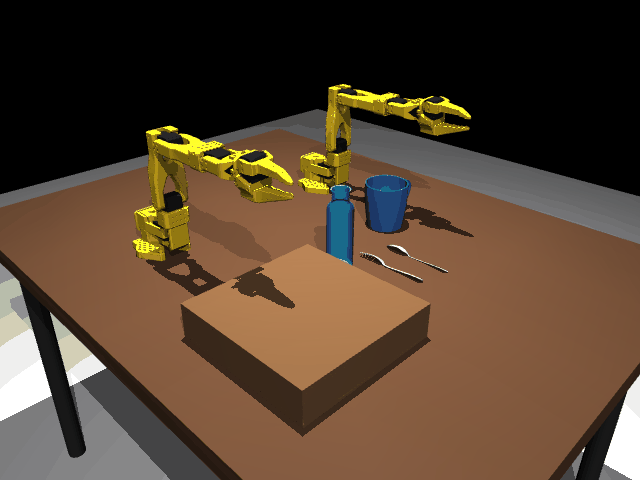
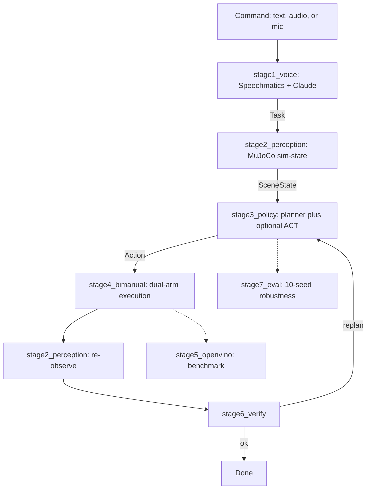

<!-- <p align="center">
  
</p> -->

<h1 align="center">Butler AI</h1>
<p align="center"><b>Two simulated SO-101 arms set a dinner table from a spoken command.</b></p>
<p align="center">
Intel Physical AI Online Challenge — Bimanual VLA Manipulation with Multi-Modal Reasoning<br>
<a href="https://lablab.ai/ai-hackathons/ai-infra-summit-hackathon/">lablab.ai AI Infra Summit Hackathon</a> · Challenge option: <i>Setting Up a Dinner Table</i>
</p>

<p align="center">
<a href="https://drive.google.com/file/d/1tM_mr5yj0RUUEhJGEbOZgIqykB2NKViq/view?usp=sharing">Trained checkpoint</a> ·
<a href="https://colab.research.google.com/drive/1hUY1LIP8rjpQOGafFnSko-S1TPc5XygI?usp=sharing">Training notebook</a> ·
<a href="docs/TECHNICAL_DEEP_DIVE.md">Technical deep dive</a> ·
<a href="#installation--running-it">Quick start</a>
</p>

> **"Open the top drawer, pick up the plate with arm A, place it on the table, pick up the
> mug with arm B, pour water into the mug with arm A."**

<div align="center">
  
</div>

## Overview

- A voice or text command drives **two MuJoCo-simulated SO-101 arms** through a full
  drawer → plate → mug → bottle → **pour** sequence, with a genuine simultaneous
  **complementary dual-arm action**: Arm B tilts the held mug while Arm A tilts the bottle.
- Language understanding is **Speechmatics + Claude**; scene state is read live from the
  simulator; task planning is a **rule-based planner** with an opt-in, trained **LeRobot
  ACT** policy (exported to OpenVINO and benchmarked on Intel hardware) integrated into
  execution, with automatic fallback to scripted control if the policy isn't available.
- Physics is real, not scripted: grasps are **contact-gated MuJoCo welds** — a grasp only
  attaches once both gripper jaws register contact — caught and regression-tested after an
  earlier version silently "grasped" with zero contact 10/10 times. See the
  [gripper engineering story](docs/TECHNICAL_DEEP_DIVE.md#gripper--physics-engineering-story).
- **Measured, not claimed**: 60/60 skill-seed physics validation, 146/147 tests passing, and
  real OpenVINO benchmarks on two Intel machines (including a Core Ultra 7 + NPU run).
- Every claim below is tied to a file, commit, or number. Where something is a placeholder
  (demo video, a fresh 10-seed pipeline run) it's marked `[ADD]`, not filled in with a guess.

<div align="center">
  
</div>

## Scenes of the MuJoCo-simulated SO-101 arms

<table>
<tr>
<td width="33%"><p align="center"><sub>Full scene — dinner table, drawer, place setting</sub></p></td>
<td width="33%"><p align="center"><sub>Drawer open, plate visible inside</sub></p></td>
<td width="33%"><p align="center"><sub>Top-down view of both arms</sub></p></td>
</tr>
<tr>
<td width="33%"><p align="center"><sub>Drawer-tray detail, close-up</sub></p></td>
<td width="33%"><p align="center"><sub>Angled overhead, full place setting</sub></p></td>
<td width="33%">
<p align="center"><sub>Water poured in Mug</sub></p></td>
</tr>
<tr>
<td width="33%"><p align="center"><sub>Wide isometric, arms lowered toward drawer/bottle</sub></p></td>
<td width="33%"><p align="center"><sub>Drawer-tray detail, alternate crop</sub></p></td>
<td width="33%"><p align="center"><sub>Close overhead detail — drawer, mug, bottle</sub></p></td>
</tr>
</table>

<div align="center">
  
</div>

## Architecture



This is the real call graph of [`common/pipeline.py::run_once()`](common/pipeline.py) — not
an aspirational diagram. All inter-stage data is typed pydantic (`common/types.py`),
signatures pinned in [`CONTRACTS.md`](CONTRACTS.md). Full stage-by-stage walkthrough,
including exactly how language + vision + task state combine into the next action:
→ [deep dive](docs/TECHNICAL_DEEP_DIVE.md#multi-modal-reasoning).

<div align="center">
  
</div>

## 10/10 Seeds Passed - Failure Analysis & Successful Execution:

#### Failed Execution - Failure Case

https://github.com/user-attachments/assets/7bf3c6d7-2b3d-4fce-b3e6-2b0b5f90c37b

<div align="center">
  
</div>

#### Successful Execution - Final Validated Demo

https://github.com/user-attachments/assets/b8239dee-16ba-4cb7-a634-844290a1e04e

<div align="center">
  
</div>

## The task

| Step | Primitive | Arm | Result |
|---|---|---|---|
| 1 | Open drawer | A | contact-gated pinch grasp → weld → pull → clean release |
| 2 | Pick plate | A | live-pose rim grasp, lift clear of the drawer tray |
| 3 | Place plate | A | levelling-pitch search so the plate lands flat |
| 4 | Pick mug | B | handle-relative grasp, lift to holding station |
| 5 | Pick bottle | A | side/body grasp, pre-computed pour-side roll |
| 6 | **Pour** | A + B | Arm B tilts the mug **while** Arm A tilts the bottle — closed-loop, simultaneous |

**Not implemented**, stated plainly: spoon/fork retrieval, closing the drawer, and a literal
object hand-off between grippers (the pour is complementary, not a hand-off — the two arms
never exchange an object). Each arm owns disjoint objects throughout. This still satisfies the
challenge brief's own example of complementary action ("one arm holding a mug while the other
pours"). Full coordination mechanics (standby parking, contact-audit collision checks, why
this is harder than single-arm pick-and-place) → [deep dive](docs/TECHNICAL_DEEP_DIVE.md).

<div align="center">
  
</div>

## Results at a glance

| | |
|---|---|
| **Skill-level physics validation** | **60/60** — all 6 primitives, 10 randomized seeds each, contact audit clean |
| **Test suite** | **146 / 147** passing (`pytest -q -m "not live"`), 150 tests total, 3 gated behind a real API key |
| **Domain randomization** | placement, yaw, friction, mass, lighting — seeded, reproducible per-seed |
| **OpenVINO — CPU** (i7-10510U) | 630 ms/chunk, matches PyTorch to `2.4e-7` |
| **OpenVINO — Intel iGPU** | 501 ms/chunk |
| **OpenVINO — Core Ultra 7 NPU** | 572 ms/chunk, matches PyTorch to `~1e-3 rad` (correct; **not yet faster** than CPU — no quantization attempted) |
| **Learned ACT policy** | trained (10k steps, external GPU run), exported, benchmarked — **not yet validated for closed-loop task success** |
| **Full pipeline, 10-seed eval** | harness implemented and runnable; committed report predates recent physics fixes — see [below](#robustness--evaluation) |

Full benchmark tables (both machines, all devices, precision/latency/throughput) →
[deep dive](docs/TECHNICAL_DEEP_DIVE.md#intel--openvino-benchmark-results-in-full).

<div align="center">
  
</div>

## Robustness & evaluation

**Skill-level (measured, real)**: `VOICE_STUB=1 python scripts/evaluate.py --seeds 10` and
`python scripts/verify_all_10_seeds.py` — 10/10 on all six primitives, seeds 100–109, with
per-skill contact-audit checks. This isolates physics/grasping robustness from the full
voice→perception→policy pipeline.

**Full-pipeline (the official deliverable)**: `stage7_eval/evaluate.py` runs the complete
pipeline per seed and is fully implemented — but the `evaluation_report.json` currently
committed predates the [gripper/weld fix](docs/TECHNICAL_DEEP_DIVE.md#gripper--physics-engineering-story)
and shows only 2 seeds, 0 successes. Rather than replace that with an invented number, the
table below is a placeholder to fill in with a fresh run before the submission video:

**Success rate = successful seeds ÷ 10 × 100 = `100`%** — regenerate with:
```bash
python scripts/evaluate.py --seeds 10 --output evaluation_report.json
```
<div align="center">
  
</div>

### Demo Videos and working links:

#### Submission demo video
`https://lablab.ai/ai-hackathons/ai-infra-summit-hackathon/labtik/butler-ai-bimanual-physical-ai` — command → randomized initial scene → perception/policy inference →
coordinated dual-arm execution including the pour → final state, per the official
recommended demonstration sequence.

#### 10-seed evaluation video

https://github.com/user-attachments/assets/60adf8f6-8d83-434f-ab53-aad4ea544d29

<div align="center">
  
</div>


<div align="center">
  
</div>

## Challenge rubric coverage

No self-scoring — only where the evidence for each official criterion lives.

| Criterion (pts) | Evidence |
|---|---|
| End-to-End Task Completion & Bimanual Manipulation (30) | [The task](#the-task), [primitives.py](stage4_bimanual/primitives.py), `stage4_bimanual/README.md` |
| VLA / Multi-Modal Reasoning (20) | [Architecture](#architecture), `stage1_voice/`, `stage3_policy/` |
| Robustness & Generalization (15) | [Results at a glance](#results-at-a-glance), [Robustness & evaluation](#robustness--evaluation) |
| OpenVINO & Intel Core Ultra Optimization (20) | [Results at a glance](#results-at-a-glance), [full benchmarks](docs/TECHNICAL_DEEP_DIVE.md#intel--openvino-benchmark-results-in-full) |
| Technical Quality & Reproducibility (10) | [Testing](docs/TECHNICAL_DEEP_DIVE.md#testing), [Installation](#installation--running-it), [`CONTRACTS.md`](CONTRACTS.md) |
| Innovation & Technical Demonstration (5) | Hybrid learned/scripted policy with fallback, closed-loop mouth-tracking pour, source-inspecting regression test |

<div align="center">
  
</div>

## Repository structure

```
.
├── common/            # shared pydantic types + run_once() pipeline entrypoint
├── stage1_voice/       # ASR + Claude instruction parsing -> Task
├── stage2_perception/   # sim-state adapter (live) + ArUco/homography vision (dormant)
├── stage3_policy/        # rule-based planner + learned/ (ACT schema, inference, training)
├── stage4_bimanual/       # MuJoCo dual-arm primitives, physics, contact audit
├── stage5_openvino/        # OpenVINO export + benchmark
├── stage6_verify/           # postcondition verification + replan signal
├── stage7_eval/               # multi-seed robustness harness
├── scripts/                    # CLI entrypoints (see below)
├── assets/                      # MuJoCo scene/meshes, SO-ARM100 MJCF, checkpoints*
├── configs/default.yaml          # seeds, randomization, model paths, hardware target
├── docs/                          # this deep dive + visualizations/
└── data/                            # collected datasets*

  * assets/models/, data/*, outputs/ are gitignored (generated/large) — see below.
```

<div align="center">
  
</div>

## Installation & running it

**Requirements**: Python 3.12.10 confirmed working (torch 2.11.0+cpu, openvino
2026.3.1–2026.4.0, lerobot 0.6.1, mujoco 3.13.0). The base pipeline only needs
`pydantic`/`pyyaml`/`numpy` — heavier deps stay optional by design.

```bash
git clone <this repository> && cd ai-infra-summit-hack
python -m venv .venv && source .venv/bin/activate   # or .venv\Scripts\activate on Windows
pip install -r requirements.txt

# per-stage extras, as needed:
pip install mujoco opencv-python speechmatics-python anthropic python-dotenv
pip install -r stage3_policy/requirements-learned.txt   # lerobot, torch
pip install openvino

cp .env.example .env   # set ANTHROPIC_API_KEY, SPEECHMATICS_API_KEY
```

**Model checkpoint** (gitignored, 329MB): download from the [checkpoint link](https://drive.google.com/file/d/1tM_mr5yj0RUUEhJGEbOZgIqykB2NKViq/view?usp=sharing)
into `assets/models/act_open_drawer/` and `assets/models/openvino_open_drawer/` — fully
optional, the pipeline falls back to scripted control without it.

```bash
# Stub-mode sanity check (no API keys, no MuJoCo required)
VOICE_STUB=1 python scripts/run_pipeline.py

# Full pipeline from text
python scripts/run_pipeline.py --command "open the top drawer, pick up the plate with arm A, place it on the table, pick up the mug with arm B, pour water into the mug with arm A"

# From audio / live mic, with viewer or recording
python scripts/run_voice_pipeline.py --audio stage1_voice/samples/official_command.wav --view
python scripts/run_voice_pipeline.py --mic --seconds 6 --record outputs/demo.mp4

# Skill-level physics validation (10 seeds)
python scripts/verify_all_10_seeds.py

# Full pipeline randomized evaluation (the official deliverable)
python scripts/evaluate.py --seeds 10 --output evaluation_report.json

# Learned-policy robot control (PyTorch or OpenVINO backend)
python scripts/control_robot_act.py --command "open the top drawer" --backend openvino --device GPU.0 --view

# OpenVINO export + accuracy/latency comparison
python -m stage5_openvino.export_act --checkpoint assets/models/act_open_drawer --dataset data/butler_demos/open_drawer

# Tests
pytest -q -m "not live"   # 146/147 passing, no API key needed
```

<div align="center">
  
</div>

## Future work

Scale demonstrations for `pick`/`place`/`pour`, wire the vision pipeline into the live camera
feed, evaluate a language-conditioned policy (e.g. SmolVLA), measure closed-loop ACT task
success, INT8/NNCF quantization for NPU throughput, consume the planner's pose/force output
in the executor, real SO-101 hardware deployment. Details → [deep dive](docs/TECHNICAL_DEEP_DIVE.md#full-limitations-list).

<div align="center">
  
</div>

## Team & contributions

| Stage | Owner | Owned |
|---|---|---|
| Voice & Instruction Understanding | Alex | Speechmatics + Claude → structured `Task` |
| Scene Perception | Lauren | ArUco/homography vision, calibration |
| Policy / Task Reasoning | Bidipta + Muhammad (data) | Planner, LeRobot ACT training/export |
| Bimanual Coordination & Drawer | Alex | MuJoCo dual-arm primitives, physics, contact audit |
| Intel Model Optimization | Lauren | OpenVINO export and benchmarking |
| Verify & Recover | Abdullah | Postcondition checks, replan signal |
| Robustness & Randomized Eval | Abdullah | Domain randomization, seed evaluation |
| Integration & Submission | Alex | End-to-end wiring, README, packaging |

<div align="center">
  
</div>

## Acknowledgements

**Intel** and **lablab.ai** for the [Physical AI Online Challenge](https://lablab.ai/ai-hackathons/ai-infra-summit-hackathon/)
and OpenVINO/Core Ultra tooling · **Hugging Face LeRobot** for ACT and `LeRobotDataset` ·
**TheRobotStudio / SO-ARM100** for the SO-101 models used directly in `assets/SO-ARM100/` ·
**MuJoCo** · **Anthropic Claude** and **Speechmatics**

## License

MIT — see [LICENSE](LICENSE).
